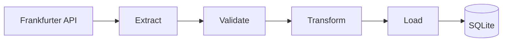

# RandFlow ETL

RandFlow is a compact data engineering project that extracts current South
African rand (ZAR) exchange rates, validates the API response, transforms the
rates into analysis-ready records, and loads them into SQLite.

## Pipeline

## WeThinkCode verification

`WTC-LP385CTD`



1. **Extract** calls the Frankfurter API for the selected currencies.
2. **Validate** rejects missing, malformed, or non-positive rates.
3. **Transform** produces one clean row per target currency.
4. **Load** upserts the rows into SQLite without creating duplicates.
5. **Automate** runs the test suite on Python 3.11 and 3.12 with GitHub Actions.

## Technology

- Python 3.11+
- Requests
- SQLite
- pytest
- GitHub Actions

## Project structure

```text
randflow-etl/
├── .github/workflows/tests.yml
├── data/
├── reports/
├── src/
│   ├── extract.py
│   ├── validate.py
│   ├── transform.py
│   ├── load.py
│   └── pipeline.py
├── tests/
├── requirements.txt
└── README.md
```

## Setup

```bash
git clone https://github.com/Lindani-cloud/randflow-etl.git
cd randflow-etl
python3 -m venv .venv
source .venv/bin/activate
pip install -r requirements.txt
```

## Run the pipeline

Run with the default configuration: ZAR as the base currency, USD/EUR/GBP as
targets, and `data/randflow.db` as the database.

```bash
python3 -m src.pipeline
```

Supply explicit options when required:

```bash
python3 -m src.pipeline \
  --base ZAR \
  --targets USD,EUR,GBP \
  --database data/randflow.db
```

A successful run prints:

```text
Loaded 3 exchange rates into data/randflow.db
```

## Query the loaded data

```bash
sqlite3 -header -column data/randflow.db \
  "SELECT * FROM exchange_rates ORDER BY target_currency;"
```

The table uses `rate_date`, `base_currency`, and `target_currency` as its
composite primary key. Running the pipeline again updates an existing rate
instead of inserting a duplicate.

## Tests

```bash
pytest -q
```

The tests use mocked API responses and temporary SQLite databases, so the core
pipeline can be checked without changing the real project database.

## Data source

Rates come from the [Frankfurter API](https://frankfurter.dev/), which does not
require an API key.

## Progress

- [x] Extract exchange rates from an API.
- [x] Validate incomplete and invalid responses.
- [x] Transform rates into structured records.
- [x] Load and upsert records in SQLite.
- [x] Add automated unit and integration tests.
- [x] Run tests automatically with GitHub Actions.
- [ ] Add a generated analytics report.
- [ ] Record and link the YouTube demonstration.

## Status

The complete ETL path and CI checks are operational. Reporting and the recorded
demonstration are the remaining presentation tasks.
